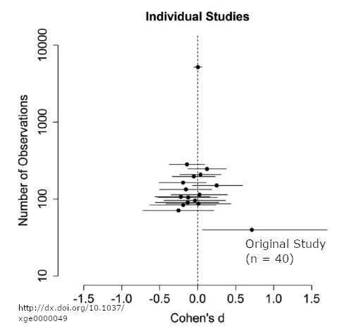
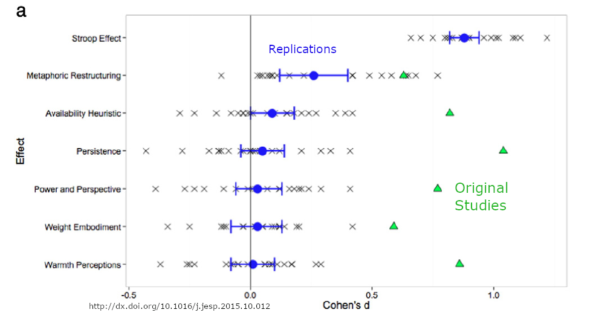

```{r setup, include=FALSE}
library(knitr)
opts_chunk$set(echo = FALSE)
options(htmltools.dir.version = FALSE)
library(DiagrammeR)
```

class: middle center inverse

# Experimental Research


---

## Experimentation

.large[
* What is a true experiment?
* Why is it considered by many to be the gold standard of research?
* What are some of the limitations of experiments?
* What is "control" and why is it important?
]
---

## Experiment

.large[
Experiment - type of empirical research in which the independent variable is manipulated, to determine the impact of this independent variable on the dependent variable.
]

---

## Public vs. Private School: Which is better for College Preparation?

--

```{r}
grViz('
digraph thirdvar {
  rankdir = LR
  graph [overlap = false, fontsize = 7, layout = neato,
  splines = true]
  node [shape = box]
  edge [color = "gray"]
  # nodes
  IV[pos="1,3!", label = "School type"]
  DV[pos="5,3!", label="Achievement"]
 # CV[pos="1,5!", label="SES"]
  
  # paths
 # CV -> DV
  #CV -> IV
  edge [color = "black"]
  IV -> DV
}
      ')
```

---

## Public vs. Private School: Which is better for College Preparation?


```{r}
grViz('
digraph thirdvar {
  rankdir = LR
  graph [overlap = false, fontsize = 7, layout = neato,
  splines = true]
  node [shape = box]
  edge [color = "gray"]
  # nodes
  IV[pos="1,3!", label = "School type"]
  DV[pos="5,3!", label="Achievement"]
  CV[pos="1,5!", label="SES"]
  
  # paths
  CV -> DV
  CV -> IV
  edge [color = "black"]
  IV -> DV
}
      ')
```


---

## Confounding: The third variable problem

```{r}
grViz('
digraph thirdvar {
  rankdir = LR
  graph [overlap = false, fontsize = 7, layout = neato,
  splines = true]
  node [shape = box]
  edge [color = "gray"]
  # nodes
  IV[pos="1,3!"]
  DV[pos="5,3!"]
  CV[pos="1,5!"]
  
  # paths
  CV -> DV
  CV -> IV
  edge [color = "black"]
  IV -> DV
}
      ')
```

---

## What can we do about this problem?


## Public vs. Private School: Which is better for College Preparation?


```{r}
grViz('
digraph thirdvar {
  rankdir = LR
  graph [overlap = false, fontsize = 7, layout = neato,
  splines = true]
  node [shape = box]
  edge [color = "gray"]
  # nodes
  IV[pos="1,3!", label = "School type"]
  DV[pos="5,3!", label="Achievement"]
  CV[pos="1,5!", label="SES"]
  
  # paths
 # CV -> DV
  CV -> IV
  edge [color = "black"]
  IV -> DV
}
      ')
```

---

## Public vs. Private School: Which is better for College Preparation?


```{r}
grViz('
digraph thirdvar {
  rankdir = LR
  graph [overlap = false, fontsize = 7, layout = neato,
  splines = true]
  node [shape = box]
  edge [color = "gray"]
  # nodes
  IV[pos="1,3!", label = "School type"]
  DV[pos="5,3!", label="Achievement"]
  CV[pos="1,5!", label="SES"]
  
  # paths
  CV -> DV
 # CV -> IV
  edge [color = "black"]
  IV -> DV
  
  node[shape = circle]
  
  RA[pos="1,4!"]
  
  RA -> IV
}
      ')
```

??

Charter School Experiment


---

## Between vs Within Subjects Designs


---
class: inverse center middle

# Replication Crisis

---

## Disfluent Font
 
a bat and a ball cost $1.10 in total. The bat costs $1.00 more than the ball. How much does the ball cost? 

<font face='Agency FB' color = "gray"> a bat and a ball cost $1.10 in total. The bat costs $1.00 more than the ball. How much does the ball cost? </font>
 
---

## Disfluent Fonts Does Not Replicate

```{r out.width="55%"}

```

---

## Problems in Social Psychology

```{r out.width="80%"}

```


