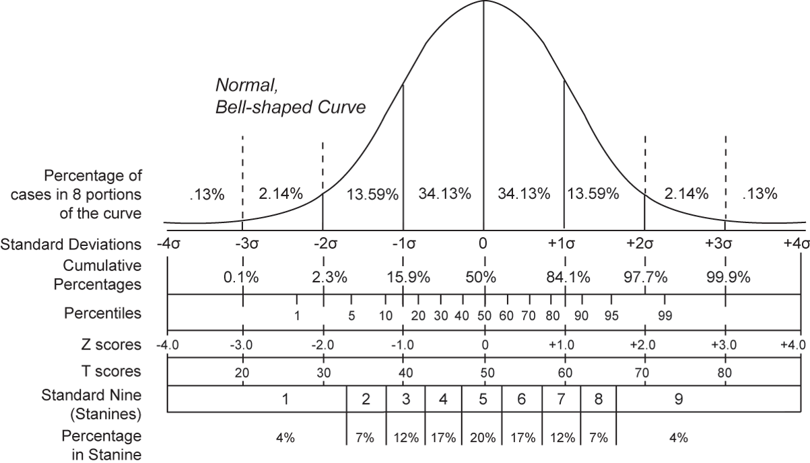
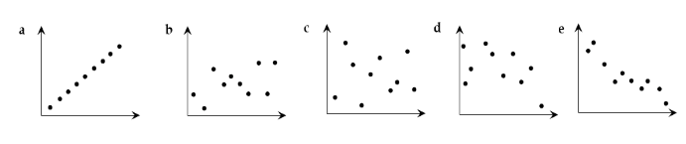
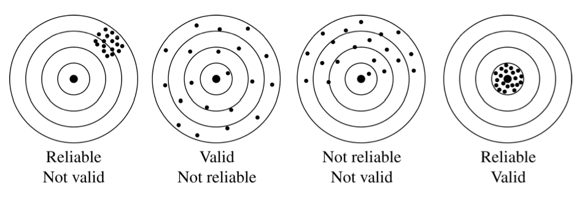

```{r setup, include=FALSE}
library(knitr)
opts_chunk$set(echo = FALSE)
options(htmltools.dir.version = FALSE)
```


---


## Overview

* Check-in on Projects
* Descriptive Statistics
     + Scales of Measurement
     + Measures of Central Tendency
     + Measures of Variability
     + Normal Distribution/ Standard scores
     + Measures of Association
* Reliability and Validity

---

# Descriptive Statistics

---

## Scales of Measurement


---

## Scales of Measurement


* Nominal (categorical)—numbers have no mathematical meaning, just category indicators

* Ordinal—can make greater than/less than comparisons
     + Rankings

* Interval—consistent intervals between scores (how much greater), zero not meaningful

* Ratio—rare in social science research, allows meaningful ratios, has zero point

* *Interval and ratio scales are treated the same in the statistics we’ll see. Ordinal and nominal are treated differently.*

---

## Data Matrix and Scales of Measurement

```{r results='asis', error=FALSE, out.width=2}
library(knitr)
source("code/exdat.R")
kable(dat)

```


* gender: categorical, nominal
* sleep: numerical, ratio
* bedtime: categorical, ordinal
* countries: numerical, interval
* dread: categorical, ordinal - could also be used as numerical 

---

## Measures of Central Tendency

* **Mean** - Arithmetic average
* **Median** - Middle score
* **Mode** - Most frequent score(s)

---

## Mean

```
x = 95, 97, 100, 101, 103, 101, 
    102, 105, 101, 95, 97, 101
```

$$
\bar{x} = \frac{\sum{x}}{n} = \frac{1198}{12} = 99.84
$$


Sum the values then divide by the number of values

---

## Mean

* Means are sensitive…
     + Extreme values will throw it off if they aren’t balanced.
     + Outliers become a problem.
     + Means may also be a poor measure for skewed distributions.
* Means only describe the sample
* The sample mean, then, serves as an approximation of the population mean.
* Means can be deceptive in the case of extremely varied data too…
     + (If your feet are in the freezer, and your head is in the oven, your mean body temperature might be normal, but you are far from “okay”).

---

## Mode


```
x = 95, 97, 100, 101, 103, 101, 
    102, 105, 101, 95, 97, 101
```


```{r results='asis', error=FALSE}
x <- c(95, 97, 100, 101, 103, 101, 102, 105, 101, 95, 97, 101) 
kable(table(x), label = NULL, caption = "Frequency table")
```
.pull-left[
```{r include = FALSE}
png("figures/mode2.png")
barplot(table(x), col='skyblue', xlab = 'x', ylab = 'frequency')

dev.off()
```
]

\pause
\begin{column}{0.48\textwidth}
\begin{figure}
\includegraphics{figures/mode2.png}
\end{figure}{Barchart of x}
\end{column}
\end{columns}

---

## Mode

* Most common score
* Easiest to find in rank-ordered scores (because this places identical scores next to each other)
* If 2 occurs most commonly, the mode is 2.
* Distributions can be:
     + Unimodal: one mode – ideal.
     + Bimodal: two modes
     + Multimodal: more than two modes
     + Having more than one mode is really only a problem if the modes are spread out. If the three modes are 4, 5, and 6, on a distribution ranging from 1-10, it’s not really a problem. But if they are 1, 5, and 10, it’s an issue.
* High point on the frequency distribution.

---

## Mode

```{r data, results='asis', message=FALSE, fig.height=3}
source("code/singleBiMultiModalPlots.R")
```

Unimodal, bimodal, and multimodal distributions

---

## Median

* Middle score
* If we rank order all scores (place them in order from lowest to highest, or highest to lowest) and then find the middle score, that is the median.
* In the case where there are an even number of scores, the median is the average of the two middle scores.
* Why the median?
     + Sometimes the “middle” is a better representation of a distribution than the “balance point”
     + This is particularly true in heavily skewed distributions.
     + Differences in mean and median can also be descriptive of the distribution. 

---

## Median

* Far less affected by extreme values.
     + Note that if we had many extremely high values, the median would have moved more.
     + But, given just a couple of outliers, the median didn’t move much at all.
* Technically, median can be expressed by $\theta$, but is more commonly just spelled out.
* Quartiles:
     + Quartiles are created by finding the median of the distribution on each side of the overall median, thus dividing the sample into 4 equal parts by number of cases.
     + Dividing samples into quartiles can be useful for certain purposes, but also, you will see the word “quartile”, so it is a good term to know.

---

## Mean, Median or Mode?

* The mean is usually preferred.
     + Allows for more advanced inferential statistics.
     + More reliable and stable under typical assumptions.
     + Usually a better estimate of central tendency under typical assumptions.
* Median is preferred when:
     + There are outliers that cannot be controlled.
     + Distributions are highly skewed.
     + There are missing or undetermined values, making a mean impossible.
* Mode is unusual in behavioral statistics.
     + Can be useful when a feeling of the “typical” case is needed.
     + Can also be useful for comparisons of central tendency estimates, or to assess the shape of the distribution.

---

## Measures of Variability

* No measures of central tendency adequately describe the distribution of a sample.

* We also need to consider the dispersion or variability of the sample:
     + How do the scores differ across the sample?
* It is possible that the mean of a sample does not represent ANYONE in the sample!  

---

## Higher Variability and/or Higher Mean?

---

## Range

* Distance between maximum and minimum score received

* Range = Max - Min
* Very sensitive to outliers (extreme scores)
* Depends on the scale of the variable, making it difficult to compare variables (range of GPA, and IQ)

---

## Variance

* The sum of the squared deviations from the mean, adjusted for sample size.
* In other words – the average squared deviation from the mean.
* $s^2 = \frac{\sum{(x - \bar{x})^2}}{n-1}$
* The variance, then, represents the degree to which cases in the distribution vary from the mean. 
* Depends on the scale of the variable, making it difficult to compoare variables ($s^2$ of GPA and IQ)
 
---

## Standard Deviation

* Standard Deviation = $s = \sqrt{s^2}$

* For normal distributions:
     + About 68% of the cases will be within +/- 1 SD.
     + About 95% of cases will be within +/- 2 SD.
     + All but extreme cases (99.7%) will be within +/- 3 SD.

---

## Normal Distribution

* The “bell shaped curve” is a theoretical distribution of an infinite number of scores that is symmetrical, where the median, mode, and mean are all equal, and equal the 50th percentile.
* Although the standard deviation could be any value, the area in each standard deviation is defined.
* Normal distributions are asymptotic – they never reach zero in the tails, theoretically.

---

## Normal Distribution

```{r, echo=FALSE, out.width ='80%'}

```
---

## Standard Scores (z scores)

* $z = \frac{x - \bar{x}}{s}$
* Converts any distribution to one with a mean of zero and standard deviation of one.
* We can calculate the “area under the curve” between two points, and also the percentile of a given score.

---

## Measures of Association

* Covariance = amount of shared variance between two variables
* Correlation = similarity in rank order, also a standardized covariance (i.e., always on -1 to 1 scale, where covariance is in measurement scale)
     + Most common is Pearson r
 
---

## Strenght of correlation

* Scatterplots of variable X and variable Y
* Imagine drawing a line through the cloud of dots



---
class: inverse middle center

# Reliability and Validity

---

## Reliability and Validity


* **Reliability** - Consistency of a score on an instrument

* **Validity** - Whether the instrument is measuring what we intend it to measure

---

## Reliability and Validity




An instrument can be reliable without being valid, but it can't be valid without being reliable.

---

## Types of Score Reliability


* Test-retest
* Inter-rater
* Parallel forms
* Split


These all use the correlation coefficient between two parts of the test (Time 1 & Time 2; Rater 1 & Rater 2; Form 1 & Form 2; Half 1 & Half 2) as the reliability estimate.

---

## Types of Score Reliability 


* Kuder-Richardson 20 (KR-20) - average of all possible split-halves. 
     + For dichotomous items (Yes/No, True/False, correct/incorrect, etc.)
     + Unidimensional test or all of same difficulty
     
* Cronbach's Alpha($\alpha$) - measure of internal consistency
     + scale must be measuring one and only one construct
     + all items contribute equally and highly to the composite score
     
---

## Types of Validity

* Content: the extent to which the measurement adequately samples the content domain.
* Construct: The extent to which the test is an accurate measure of a particular construct or variable.
* Criterion: the extent to which a test is related to some external criterion of the construct being measured.

---

## Construct Validity

* One way of assessing construct validity is to demonstrate the evidence of convergent and Discriminant validity.
* **Convergent validity** refers to the degree to which scores correlated highly with other tests designed to assess the same construct.
* **Discriminant validity** refers to the degree scores do not correlate highly with other tests that are not designed to assess the same trait.

---

## Two types of Criterion Validity

1. Concurrent validity: instrument and criterion measures at same time, and

2. Predictive validity: criterion measured later than scores on instrument.

---

## Internal vs. External Validity

* Internal Validity - does the design of the study permit the desired inference (e.g. causal inference)?

* External Validity - Can the inferences be generalized to the desired **contexts** and **population**?

---

## External Validity

* Generalizability = external validity = How well does the study represent the findings that would be obtained (a) if we studied the full population or (b) if we changed the context?
* Population generalizability = degree to which generalization to target population is warranted
* Ecological generalizability = degree to which generalization of findings to other contexts is warranted

---

## Practice with Internal Validity

* Worksheet:
     + Review threats and complete activity in groups
     + Also, describe one thing the researcher could do to rule out the threat to internal validity.
     + Only work on items 1-5 in class. You can look at the others at home (answer key posted)


